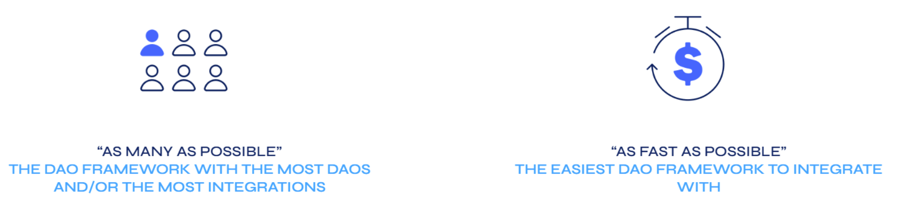
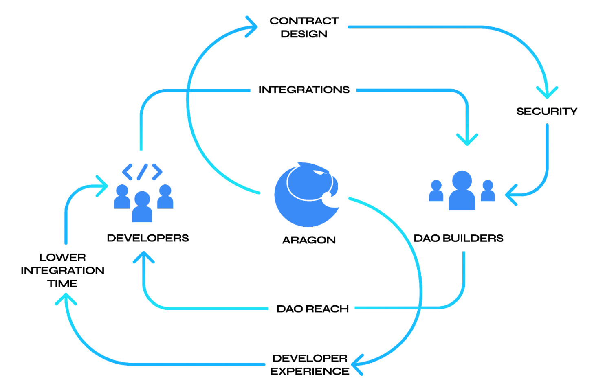

# Strategy to Become a Governance Hyperstructure

Evan Aronson, [Ivan Fartunov](https://twitter.com/TheTakenUser), and [Joan Arús](https://twitter.com/Joan_Arus)

This strategy seeks to realize Aragon’s vision of empowering everyone to _“experiment with governance at the speed of software,”_ with Aragon’s smart contract framework in the center, as the most flexible, secure, and easy-to-use framework for creating and managing decentralized organizations.

We are doubling down on the thesis that decentralized organizations ultimately depend on **on-chain permission management systems** to determine who and what can execute actions. Our strategic goal is to maximize **ecosystem compatibility** with this permission management system, giving Aragon a central role in the ecosystem’s development. This can unlock powerful and compounding network effects, potentially turning Aragon into the **[hyperstructure](https://jacob.energy/hyperstructures.html) for governance** in an increasingly global society, where trust is scarce yet the need to coordinate is higher than ever.

Before reaching these compounding network effects, our approach is to first **bootstrap** both sides of the market: (1) **supply**, by incentivizing developers to integrate with our protocol, and (2) **demand**, by funding the development of an initial application to provide no code access to new DAO builders. In parallel, we will extend our ecosystem presence through strengthened collaboration with external teams, whether they are launching their own DAOs, building new governance plugins, or even building alternative front ends for Aragon DAOs.

Aragon is recognized by reputable high TVL industry players as the best and most **secure** solution for on-chain governance. Combining this reputation with our **well-managed treasury** and **brand awareness**, we are confident that Aragon is in the best position to recapture this existing and growing market opportunity.

# Vision

The[ Aragon Manifesto](https://github.com/aragon/AGPs/blob/master/AGPs/AGP-0.md) has been at the center of Aragon’s identity since it was published in 2018, and Aragon itself has even been described as a[ manifesto-based organization](https://medium.com/aragondec/manifesto-based-organizations-3c8ddcf6e666).

We extracted the following line from the manifesto

> "Building tools to create and manage decentralized organizations will unleash a Cambrian explosion of new governance forms, and the competition among them will raise the bar globally.
>
> It will finally allow us to experiment with governance at the speed of software.”

to crystallize Aragon’s vision:

_To provide the most flexible and secure tools for creating and managing decentralized organizations, allowing everyone to experiment with governance at the speed of software._

The essence of this strategy is our theory of change about the Cambrian explosion of governance forms described in the Manifesto. In the following section, we describe the underlying infrastructure that these new governance forms will need to be built upon, which can help inform the short- and long-term paths for Aragon to sustainably provide it.

# Theory of Change

We believe it is inevitable that:

_The hyperstructure for governance will be a permission management system._

At its essence, formal governance is the process of making binding decisions. In a traditional political context, this is codified into law, enforced by courts and, if necessary, by violence.

Decentralized technologies, such as smart contract enabled blockchains, have unlocked the ability for binding decisions to be made, and actions automatically executed, without needing “trusted” intermediaries. In order for this new technology to be secure, automatic execution of these decisions depends on smart contracts having the required permissions. 

Decentralized governance frameworks are thus trustless **on-chain permission management systems.** They grant and revoke permissions for performing actions to different actors, whether these are personally held wallets or even other smart contracts with their own internal logic. A broad range of actions can be chained such that one action leads to another, all according to the permissions defined within that particular governance system.

A broader governance ecosystem can be built by introducing a new way to create and manage modular, permissioned, smart contract governance “plugins”. This will enable the collective intelligence of smart contract developers to create the building blocks of governance experimentation, leading to novel applications and use cases that we can’t yet foresee.

This ecosystem will be built on a foundation that will inevitably become the **hyperstructure for decentralized governance**.

> “Hyperstructures are protocols that can run for free and forever, without maintenance, interruption or intermediaries”

As a hyperstructure, this protocol would be unstoppable, valuable, permissionless, positive sum, credibly neutral, and would have expansive rather than extractive fees. As[ described](https://jacob.energy/hyperstructures.html) by jacob.eth, founder of Zora, these are the essential qualities that separate a hyperstructure from other protocols.

# Strategy

## Context

Since Aragon was launched 5 years ago, the broader market for DAO tooling has become a focal point within the industry. The year 2022 was even[ described](https://consensys.net/blog/blockchain-explained/2022-will-be-the-year-of-the-dao-but-practical-challenges-remain/) as the “year of the DAO.” The downside has been that powerful market narratives and regulatory concern have motivated projects to become DAOs before reaching the structural maturity that would have allowed for true decentralization. Furthermore, the previously prohibitive gas fees of the 2020-2021 bull market were used as justification for the immature industry to adopt what is now a standard combined setup of:

(1) **Off-chain governance** (e.g. Snapshot)

(2) **Core team control of funds using a multisig** **wallet** (e.g. Gnosis Safe).

The fragmentation of tooling and nascent interoperability has resulted in reliance on trusted individuals to bridge actions across tools, undermining the value of decentralization itself, and creating a disjointed experience for token holders.

In parallel, since the departure of AragonOne, funding of development by the Aragon Association on Aragon’s most widely adopted products, aragonOS and Aragon Client, ceased. This brought the development of new functionality and smart contract releases to a halt. Recent Aragon products attempted to resolve the high gas issues that the Snapshot+Safe combo was solving, but they failed to gain market share and complicated Aragon’s product portfolio. Many team members have identified that a lack of strategy and poor engagement with stakeholders and the broader community hindered Aragon from responding to this market dynamic and deteriorated its ability to ship useful products.

While no Aragon teams were working on aragonOS, other external teams, including former AragonOne developers, continued building on forked versions. To this day, the latest releases of the contracts (v4 and v5) continue to be used, accruing more “Lindy” effect as time goes on.

Due to Aragon’s unparalleled **security reputation**, several of the most important DAOs in the ecosystem are built using aragonOS. For example, [Lido’s TVL](https://blog.aragon.org/lido-success-case/) alone is nearly 1/3 of all staked ETH. Using these contracts is costly for them, because they have to invest significant resources into upgrading their DAOs when they need to add new governance functionality. 

Nevertheless, Aragon still has the **strongest brand recognition** within the DAO space, as well as a **sizable** **and well-managed treasury**. These assets, along with recent organizational changes and efforts to realign with stakeholders around a coherent overarching strategy, have helped prepare Aragon to overcome the challenges imposed by previous missteps.

## Approach

To enable governance experimentation, organizations need quick, easy, low-cost governance functionality that is flexible yet secure enough to experiment even when stakes are high. Our approach is fundamentally ecosystem driven; successful DAOs must have access to the tools that they need without being constrained to experiment with the narrow set of functionality provided by the closed platform they have chosen. Aragon-based DAOs must therefore be able to extend on-chain permissions to a broad range of new and existing tools built by third-party developers - not only those built by Aragon - to be able to freely experiment.

Our efforts should be aimed toward the following strategic goal:

_Maximize ecosystem compatibility with Aragon’s core contracts._

**Ecosystem compatibility** is the amount of native support with new and existing DAO tools, prioritized by how well they solve the needs of our target markets.

In order to drive these high-value integrations, according to our own developer user research, integrators are motivated by two primary factors: **biggest reach** and **lowest effort.**

Therefore, our proposed approach is to simultaneously focus on the **onboarding of new DAOs** (“[the next 10,000 DAOs](https://blog.aragon.org/who-will-build-the-next-10-000-daos/)”) and **decreasing the total effort** required for developers to integrate.

These dual requirements have circular dependencies. On one hand, integrators want the reach of many DAOs running on the platform. On the other hand, DAO creators choose a framework based on its compatibility with the functionalities they need. Therefore, the first and most critical strategic hurdle is to bootstrap this dual-sided market, breaking the chicken-and-egg problem.

### Bootstrapping the Two-sided Market

Our initial focus to drive adoption is to optimize **end-to-end** **interoperability** with a comprehensive SDK and a detailed developer portal housing our technical documentation to help developers **build new functionality** and **integrate existing projects.** Token incentives will also be leveraged to encourage relevant integrations. The addition of the Aragon Design System will make it easy to upgrade these functionalities into fully integrated and visually consistent plugins on Aragon App or related interfaces.

We will make our **human-centered Aragon App** (the complement) a no-code solution for DAO founders and the primary means of increasing usage of **a new version of the underlying aragonOS protocol**. By incentivizing additional integrations with other frontends and functionality, we can further “commoditize” the product. As[ described](https://variant.fund/articles/product-vs-protocol-finding-a-balance-in-web3/) by Jesse Walden:

> “These network effects bootstrapped by the commoditized product can help to attract third-party developers, who build more functionality, attracting more users and usage, compounding those network effects.”

By bootstrapping each side of the market in tandem, we can convert the dependency between third-party developers who extend protocol functionality and protocol usage into a **synergistic cycle of growth.**

Furthermore, we believe that no DAO framework (smart contract permission management system), including aragonOS, Moloch, Open Zeppelin, and Zodiac, has yet realized the potential of these network effects that, for example, Gnosis Safe already has realized as the leading multi-signature wallet.

We hope to see competitors become partners and _Aragon compatibility_ worn as a badge of honor.

### Overcoming Bigger Challenges Ahead

Aragon’s vision is not limited to the current niche of web3 natives building DAOs. To ensure we can support the governance requirements of companies, non-profits, jurisdictions, and other traditional organizations, we must be prepared when these technologies become necessary. In other words, we are _conquering the hill of web3_ to acquire a tactical advantage.

Our approach must therefore have **multiple strategic horizons**, with resources and planning to execute them in parallel. Each horizon will prepare Aragon for the next, as the market changes and our position within it evolves.

We will initially prioritize resource allocation towards onboarding new DAOs that have less value at stake and, thus, lower security requirements. We will do this because, regardless of our investment in security and evidence of our survival, _the absence of evidence is not evidence of absence_. Having confidence in the security of our new smart contract releases is not enough; time is a necessary ingredient to accrue “Lindy”, learn from our mistakes, find unexploited vulnerabilities, and be considered “battle-tested”.

Continuing to build on Aragon’s reputation for contract security and flexibility will enable us to onboard high TVL DAOs, both new and existing.

Furthermore, maintaining industry leadership within web3, as well as building a network of professional onboarding services, are both essential requirements for Aragon to be the preferred stack of traditional organizations that wish to remain competitive in the increasingly trustless, global economy.

## Course of Action

The following actions represent some of the initiatives that Aragon could support or fund to implement this strategy. They are grouped here into three strategic horizons, following the approach described above. Resource allocation is stacked toward the more immediate horizons to ensure we successfully grow our current market share. Some resources are also immediately, in parallel, allocated toward initiatives aiming to position ourselves for success in the more distant horizons. Still, by limiting this, we can protect Aragon from overspending on moonshot projects and those with speculated user needs.

* **Get big** on new **DAOs**, focusing on the **next 10,000 DAOs**. 

    * Bootstrap end-user protocol usage on the demand side:
        * Deliver the most human-centered app for creating and managing DAOs, focused on the needs of the “intermediate builders” starting with a single vertical.
            * Package our contracts’ plugin system into a user-friendly “marketplace” within Aragon App.
            * Provide a unified end-to-end proposal experience, from ideation to on-chain execution.
        * Sunset former Aragon projects Govern, Court and Voice, and include those capabilities (optimistic governance, dispute resolution, gasless off-chain voting) in the new Aragon App as plugins.
        * Build a highly professional Customer Success guild that supports new DAO builders in setting up their DAOs on Aragon and generates insights for our Product teams.
            * Maintain support for Aragon Client via a dedicated Guild to cater to the needs of existing users with the long-term intent to gradually transition these users to the new contracts.
        * Expand the DAO Experts program of external resources to support DAO founders further, becoming the “top of mind” DAO brand and broadening our ecosystem reach.
        * Invest in attracting high visibility (i.e. large user count, strong brand recognition, high memetic relevance) reference DAOs across relevant use cases.
        * Create an Ecosystem Incentive Fund to incentivize key integrations with popular front-ends with their own vertical specialization (DAO Haus, Tally, Boardroom, Commonwealth, Rally, Syndicate) to enable users to interact with aragonOS in other vertically specialized apps.
    * Bootstrap plug-in integration on the supply side:
        * Deliver an updated “aragonOS X” (working title), easily accessible via a JS SDK, based on the previous aragonOS releases, which have been rebuilt to improve developer experience, composability, flexibility, and minimize unnecessary gas consumption.
        * Provide ready-made plugin examples developed by Aragon with popular protocols or services.
        * Invest in developer relations with advocacy, interviews, and a new Developer Portal aimed to increase the ease of developing third-party plugins.
        * Use the Ecosystem Incentive Fund to incentivize key integrations with existing market-validated DAO tooling providers (SnapshotX, PrimeDAO, Gnosis, Parcel, Superfluid, Coordinape, Guild, Radicle, DeWork) to extend our functionality.
* **Lead** on **governance security**, focusing on attracting **high-TVL web3-native DAOs**.

    * Reinforce a rockstar Aragon Core developer team that will bring us back into the spotlight and allow us to steer the industry through product innovation, thought leadership, and active participation in strategic industry-wide initiatives (e.g.[ DAOstar.one](http://DAOstar.One))
    * Rebrand our new contracts to be part of the aragonOS line and update the Aragon Whitepaper to signal our commitment to the battle-tested aragonOS.
    * Invest heavily in a broad security program, including a multi-phased contract audit, audits for our initial community-made plugins, and a generous bug bounty program to incentivize white hat behavior.
    * Leverage integrations with leading ZK-tooling projects to offer Aragon DAOs low-cost and privacy-centric operations.   
    * Improve developer relations with the highest TVL DAOs built on previous versions of Aragon or other frameworks to understand their needs and concerns better.
    * Level up the definition of security across protocols with a clear plan to increase education around _security-as-a-process_, that safety goes beyond the contracts.
    * Add in Thread Monitoring systems that allow DAOs to oversee the state of the organization.
    * Provide privacy for on-chain voters.
    * Build out granular permission management for more flexibility for DAO operators.
    * Explore trustless token-based contract insurance, where plugin contracts are insured by staked ANT and collect insurance premiums when executing actions. 

* **Expand use cases,** focusing on bringing decentralized governance to **traditional organizations**. 

    * Continue deploying the Ecosystem Incentives Fund to attract relevant plugin development. For example:
        * Flexible voting systems and census types (e.g. SnapshotX, Vocdoni)
        * Resource management tools (treasury, knowledge, contributors) as well as credentials, access, analytics, and identity
        * Web2 interaction enablers (Fiat on/off-ramps, legal wrappers, KYC)
        * Smart wallets and DAO interfaces
    * Develop compatibility with the needs of corporations, non-profits, jurisdictions, and other types of traditional organizations to empower piecemeal adoption of our stack
        * Evolve the product (e.g. include enterprise-friendly APIs, gasless transactions, trusted census building)
        * Ensure white-glove technical onboarding
            * Partner with leading digital transformation consultancies
            * Professionalize web3 native technical onboarding guild(s)

# Value Capture Models

As product value capture in the web3 industry is poorly developed, the current strategy does not prioritize a specific business model. There are multiple paths towards financial sustainability, contingent on Aragon successfully scaling. We believe forcing a business model into Aragon’s value proposition before network effects kick in will put the project at a severe disadvantage. The current strategy allows for both traditional and web3 native value capture models that are not mutually exclusive:

* **Trustless security** - we require providers of products and services to stake collateral.
    * For smart contracts (such as plugins), to reimburse users in case of a hack or other vulnerability (e.g. [API3’s tokenomics model](https://docs.api3.org/api3-whitepaper-v1.0.3.pdf)). This would enable ANT holders to charge an insurance premium upon transactions. This would not be an arbitrary extractive fee, as it would be used to incentivize the staking that secures the contracts.
    * For service providers, to reimburse users in case of failure to meet agreed-upon terms and conditions (e.g. token curated registries for service providers, arbitration similar to Bounty0x).
    * For other protocols that become deeply embedded in Aragon’s ecosystem, ANT can serve as a validator staking / collateral asset (e.g. Vocdoni could update [Vochain](https://docs.vocdoni.io/architecture/services/vochain.html) to use an ANT-based proof-of-stake consensus).
* **WAGMI** - we execute token swaps with projects and services that are part of Aragon’s ecosystem (service providers, extensions, DAOs). Those swaps are scaled proportionally to the volume of protocol interaction (i.e. TVL or transacted volume), aligning Aragon’s token distribution across more relevant stakeholders. Value is being captured indirectly by sharing the financial upside of projects whose success was enabled by Aragon.
* **Revenue sharing** - we engage in revenue sharing with monetizable products and protocols that are gaining usage in conjunction with Aragon (e.g. vertically specialized front-ends, voting, computation or storage infrastructure, and service providers).

This strategic platform is versioned and will be updated as we learn from testing many of the assumptions we have had to make. We also look forward to forked versions that spawn from the community as well as completely new ideas that may have been inspired by those included here.

---

### References

1. [Hyperstructures](https://jacob.energy/hyperstructures.html) by jacob.eth
2. [The Aragon Manifesto](https://github.com/aragon/AGPs/blob/master/AGPs/AGP-0.md) by Luis Cuende
3. [Manifesto-based organizations](https://medium.com/aragondec/manifesto-based-organizations-3c8ddcf6e666) by Luis Cuende
4. [2022 Will Be The Year Of The DAO, But Practical Challenges Remain](https://consensys.net/blog/blockchain-explained/2022-will-be-the-year-of-the-dao-but-practical-challenges-remain/) by Megan Au
5. [Lido: Aragon Contract Secures Ethereum Liquid Staking Service](https://blog.aragon.org/lido-success-case/) by Aragon
6. Developer Persona Research, _publication pending_, by Harry Wilson and Juliette Chevalier
7. [Who will Build the next 10,000 DAOs?](https://blog.aragon.org/who-will-build-the-next-10-000-daos/) by Aragon 
8. [Product vs. Protocol: Finding a Balance in Web3](https://variant.fund/articles/product-vs-protocol-finding-a-balance-in-web3/) by Jesse Walden
9. [The GLEe Model](https://gibsonbiddle.medium.com/6-the-glee-model-6af740bdf3b1) by Gibson Biddle

---

_The authors would also like to thank [juar.eth](https://twitter.com/0xPaella), [sio.eth](https://twitter.com/sio_eth), and [Ramon Canales](https://twitter.com/ramonistweeting) for their feedback while drafting this strategy; [Harry Wilson](https://twitter.com/_harrywilson) and [Juliette Chevalier](https://twitter.com/_juliettech) for their informative market and user research; and both [Jessica Smith](https://twitter.com/ctznofinifinity) and [Samantha Marin](https://twitter.com/samanthajmarin) for their word magick._
